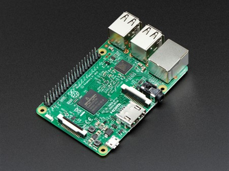
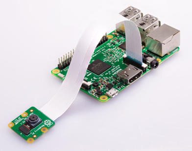
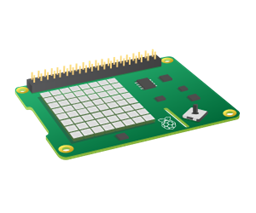

# Kom i gang med Raspberry PI



## Innhald

- [Introduksjon](#introduksjon)
- [1. Installer operativsystem til disk/minnekort](#1-installer-operativsystem-til-diskminnekort)
- [2. Konfigurasjon og bli kjent med GUI](#2-konfigurasjon-og-bli-kjent-med-gui)
- [3. Oppgradere og oppdatere](#3-oppgradere-og-oppdatere)
- [4. Slå av (viktig!)](#4-slå-av-viktig)
- [5. Fjernstyring og fjerntilgang](#5-fjernstyring-og-fjerntilgang)
- [6. Bli kjent med terminalen](#6-bli-kjent-med-terminalen)
- [7. Raspberry PI kamera](#7-raspberry-pi-kamera)
- [8. SenseHAT](#8-sensehat)

Det ligg mange oppgåver og løysingsforslag tilknytta dei ulike seksjonane.

## Introduksjon

Raspberry PI er ei lita, rimeleg datamaskin som kan brukast til mange ulike prosjekt. Den har mange tilkoplingsmoglegheiter for sensorar, motorar, lys og anna elektronikk, og kan programmerast med Python og andre språk.

Forbered deg på å lese og slå opp undervegs - der du ofte må finne ressursar sjølv. Gjer eit poeng ut av at du må forstå kva du gjer, og ikkje til dømes berre kopierer og limer inn kode.

Det er nokre sentrale ressursar du bør bli kjent med aller først. 
- Heimesidene til produsentane: http://www.raspberrypi.org/ - Her er det mykje god hjelp å få! Sjekk ut dokumentasjon, prosjekt og forum.
- Samleside med offisiell hjelp: https://www.raspberrypi.org/help/ 
- Samleside med ulike, offisielle prosjekt: https://projects.raspberrypi.org/en/projects 
- Sjekk ellers gjerne ut [Pimoroni](https://www.pimoroni.com/), [The Pi Hut](https://thepihut.com/), [Adafruit](https://www.adafruit.com/), [SparkFun](https://www.sparkfun.com/) og andre som sel produkter til Raspberry og liknande system. Desse har masse tips til kva du kan bygge, med gode og detaljerte guidar.

Søk gjerne på Raspberry PI og eit tema du er interessert i på YouTube, Google eller liknande. Det finst mange gode videoar og artiklar som viser korleis du kan løyse ulike problemstillingar.

Eksempelprosjekt:
- Emulering og retrospel: RetroPie, Lakka
- Media-senter: Plex, Jellyfin, Kodi
- Smarthus: Home Assistant, OpenHAB, Domoticz
- Nettverk og sikkerheit: PiVPN, Pi-Hole
- Smartspegel: MagicMirror²
- Robotikk: Bygg din eigen robot med Raspberry Pi

## 1. Installer operativsystem til disk/minnekort

[Offisiell guide](https://www.raspberrypi.com/documentation/computers/getting-started.html#installing-the-operating-system)

Me brukar Raspberry Pi Imager for å installere operativsystemet på eit minnekort eller ein disk, som du kan laste ned frå: https://www.raspberrypi.com/software/

Du vel sjølv kva operativsystem du ønskjer å bruke. For nybegynnarar er Raspberry PI OS (tidlegare kalla Raspbian) eit godt val. Det finst i fleire variantar, med eller utan grafisk brukargrensesnitt. Vel den som passar best til ditt bruk. I Raspberry PI OS er det integrert ein del hjelpemiddel, til dømes Python-språket, ulik programvare, med meir. 

Vårt startpunkt er typisk:
- Raspberry PI 4
- "Raspberry PI OS with desktop and recommended software"

Før skriving til minnekortet/disk kan du sette innstillingar som brukarnavn og passord, namn på maskina (hostname), WiFi-innstillingar, aktivere SSH, med meir. Dette anbefalast å gjere.

Medan OS blir skrive til minnekortet/disk, pakk gjerne ut og bli kjent med resten av maskinvaren, og nødvendige komponentar.

Viktige begrep å ha kontroll på etter dette punktet er:
- OS - operativsystem - Linux - Debian - Raspberry PI OS
- SD-minnekort
- Lagringsenhet/Harddisk (og gjerne alternativ som SSD, USB-minnepinne)

## 2. Konfigurasjon og bli kjent med GUI

Dersom du ikkje satte innstillingar under forrige punkt, så vil det første gong du startar opp Raspberry PI-en din dukke opp eit konfigurasjonsprogram. Me ser på desse innstillingane saman. Eksempel er “internasjonaliseringen” for at tastaturet skal “oppføre seg” (t.d. norsk tastatur).

Dersom konfigurasjonsprogrammet nevnt over ikkje opnar seg automatisk må du starte det manuelt. Frå det grafiske grensesnittet går du i menyen oppe til venstre og finn det (`Preferences` og deretter `Raspberry Pi Configuration`). Eit alternativ er å opne `terminal` og skriv fylgjande kommando: `sudo raspi-config` (NB: Dette er den “gamle” måten å gjere det på, utan å bruke grafisk brukergrensesnitt).
 
Dersom du startar opp i det grafiske grensesnittet kan du navigere deg rundt og bli kjent slik du sjølv ser er best. Kva programvare ligg inne som standard? Går ting like fort som på maskina du til vanleg bruker? Ikkje bruk tida på å spele spel, anna enn å bekrefte at det fungerer.

## 3. Oppgradere og oppdatere

NB: Desse kommandoane krev internettilgang (merk at du ikkje kan bruke det vanlege skulenettverket du bruker på din eigen bærbare). Du kan ikkje bruke det same du gjer på din bærbare.

Kommandoar du bør kjenne til:
- `sudo apt-get update` (oppdaterer listene over kvar ein kan laste ned oppdateringar, mm.)
- `sudo apt full-upgrade` (lastar ned faktiske oppdateringar til program, mm.)
- [Meir informasjon om oppgradering](https://www.raspberrypi.com/documentation/computers/os.html#update-software)

## 4. Slå av (viktig!)

Det er potensiale for tap av data dersom du berre koblar frå straumen medan OS køyrer.

Derfor:
- Logisk dersom GUI er tilgjengeleg: Frå GUI er det berre å velge dette frå menyen oppe til venstre.
- Alternativ: Frå terminalen/kommandolinja skriv du til dømes 
    - `sudo shutdown now`
    - `sudo halt`
    
Vent litt slik at alle tjenestane får slått seg av før du tek ut straumkabelen.

## 5. Fjernstyring og fjerntilgang

### 5.1 Innleiing

Det er mange moglege måtar å koble seg til vår Raspberry PI på, i tillegg til å bruke den som ei vanleg datamaskin. Av og til har me ikkje moglegheit til å koble til skjerm (eller, det vil vere tungvint), som på ein robot, eller me vil kunne hente bileter eller verdata frå ei maskin som står ein annan stad og samlar data.

Den offisielle guiden for fjerntilgang og fjernstyring av Raspberry PI-en din finn du her: https://www.raspberrypi.com/documentation/computers/remote-access.html 

Kort oppsummering som gjeld for oss på skulen:

### 5.2 Internett i klasserommet
Nettverk til Raspberry PI (og eventuelle tilkoblingar for PC mot Raspberry PI via SSH):
- Nettverknavn (SSID): RaspNett eller 2ITKA-2Ghz
- Passord: spør lærar

NB: Me må vere tilkobla det same nettverket både med datamaskina og Raspberry PI-en.

### 5.3 Anbefalt framgangsmåte for tilkopling:

Den klare anbefalinga, og det alle skal forsøke, er `SSH`, som lar oss til dømes koble oss direkte til Raspberry PI-en og skrive kommandoar frå vår eige datamaskin som om me sit på PI-en. Sjå: https://www.raspberrypi.com/documentation/computers/remote-access.html#ssh 

Slik koblar du deg til Raspberry PI-en via SSH:
- Finn IP-adressa til Raspberry PI-en din. Dette kan du gjere ved å skrive `hostname -I` i terminalen på Raspberry PI-en, eller ved å sjekke ruteren din for tilkobla einingar.
- Frå di eiga datamaskin opnar du terminalen (Linux/Mac) eller PowerShell (Windows).
- Skriv inn fylgjande kommando, der du erstattar `pi` med brukarnamnet ditt på Raspberry PI-en (standard er `pi`), og `10.20.x.x` med IP-adressa du fann tidlegare:
    ```
    ssh pi@10.20.x.x
    ``` 
- Dersom du blir spurt om å godkjenne tilkoplinga, skriv `yes` og trykk enter.
- Skriv inn passordet ditt når du blir spurt (standard er `raspberry` dersom du ikkje har endra det).
- Du er no tilkopla Raspberry PI-en via SSH og kan skrive kommandoar som om du sat ved den.

### 5.4 Alternative tilkoplingsmetodar

Alternativ:
- `Putty` er eit fint alternativ, og er ein Windows-klient for å setje opp ein slik forbindelse dersom du ikkje har innebygd ssh og kan køyre dette direkte frå kommandolinja, terminal eller PowerShell.
- `Filoverføring` gjer akkurat det det høyres ut som, koblar oss til, viser ein opplisting av filer, og lar oss laste ned og opp filer etter behov. Ein anbefalt klient med eit grafisk brukergrensesnitt er FileZilla. NB: Bruk IP-adressa og port 22.
- `Fjerntilgang, grafisk (VNC)`: Du får i dette tilfellet opp det som køyrer på PI-en som om du sat ved den, tilkobla med skjerm og alt det andre du måtte bruke. Forskjellen på VNC og SSH er altså at du her får sett det grafiske (SSH er berre tekst). Bruksområde er mellom anna når du har ein god tilkobling, med lite til ingen begrensingar når det gjeld dataoverføring. Ein fyldigare gjennomgang av alt som er mogleg finn du hjå RealVNC.

## 6. Bli kjent med terminalen

Alle skal opne "terminalen". Her blir du møtt med litt tekst og ei linje som blinkar mot deg og ventar på kommandoar.

NB! Lær deg at du kan bruke `TAB` for å automatisk fullføre til dømes filnavn og ein del kommandoar. Dersom du er i ei mappe med ei fil som har verdens lengste og mest “knotete” filnavn så kan du begynne å skrive den første bokstaven for så å bruke TAB for å fullføre det.

Me deler dette opp i to delar. Den første delen er å bli kjent med nokre grunnleggande kommandoar i fellesskap for å navigere i filsystemet, opprette og slette filer og mapper, med meir. Den andre delen er eit meir omfattande kurs. Til slutt bør du kontrollere om du har fått med deg nokre av dei viktigaste punkta ved å gjere oppgåva.

### 6.1 Grunnleggande kommandoar

Me blir først kjent med nokre av dei mest grunnleggande kommandoene, før de går vidare til kurset i terminalen. Det er viktig å kunne desse kommandoene for å kunne navigere og jobbe effektivt i terminalen.

Me ser på desse i fellesskap:
- `pwd` - “Working directory”; kvar er det du står akkurat no.
- `ls` - Dette ber om ein opplisting av innhaldet i mappa du står i. Du får no opp typisk fleire mapper og kanskje nokre filer.
- `touch` - Opprettar ei fil, med spesifisert navn. Skriv du til dømes touch test.py så kan du etterpå kontrollere med ls om det ligg ei fil med det navnet der. NB: Fila er tom.
- `mkdir` - Opprettar ei mappe, med spesifisert navn. Skriv du til dømes mkdir animasjon så kan du etterpå kontrollere med ls om det ligg ei mappe med det namnet der.
- `cd navnpåmappe` - cd står for change directory, etterfølgt av kva mappe du vil opne. Gå inn i mappa du oppretta i forrige punkt.
- `cd ..` - Dette gjer at du hoppar eit nivå opp, tilbake der du starta.
- `sudo` - Finn ut kva dette betyr!
- `sudo apt install navnpåprogram` - Dette er kommandoen for å installere programvare. Skriv inn denne kommandoen etterfulgt av namnet på programmet du vil installere, og trykk enter. Følg instruksjonene på skjermen for å fullføre installasjonen.
    - Me installerer cmatrix, cowsay, lolcat og ranger for litt morro.
- `python3 filnavn.py` - Dette er kommandoen for å køyre ei Python-fil.
- `nano filnavn.py` - Dette er kommandoen for å redigere ei fil i terminalen ved hjelp av tekstredigeringsprogrammet nano.

### 6.2 Meir omfattande kurs i terminalen

[Trond](https://github.com/troska) har laga eit kurs i terminalen, som er meir omfattande enn det som er skissert over. Dette anbefalast å gå gjennom for alle.

Sjå guiden her: [Kurs i Linux-terminalen](https://fresh-linux-terminal.surge.sh/)

### 6.3 Lag dine eigne script

Det er mogleg å lage eigne script som køyrer fleire kommandoar i rekkefølgje. Dette kan vere nyttig for å automatisere oppgåver eller for å lage enkle program. Fylgj denne guiden for å lage ditt første script: https://projects.raspberrypi.org/en/projects/raspberry-pi-command/1

### 6.3 Oppgåve

Etter å ha vore gjennom guiden over og "leikt" deg litt i terminalen, så skal du no prøve deg på litt av det du har lært:
- Opprett ei mappe som heiter `prosjekt`.
- Gå inn i denne mappa.
- Opprett ei fil som heiter `test.py`.
- Skriv inn nokre linjer med tekst i denne fila, for eksempel:
    ```python
    print("Hei, dette er ein test!")
    print("Dette er linje 2")
    print("Dette er linje 3")
    ```
- Køyr fila i terminalen ved å skrive `python3 test.py`.
- Bruk `cat` for å sjå innhaldet i fila.
- Bruk `grep` for å søke etter linjer som inneheld ordet “linje”.
- Skriv resultatet av at programmet køyrer i ei ny fil, for eksempel `resultat.txt`, ved å bruke `>`-operatoren.

### 6.4 Alternative kjelder
- https://github.com/jlevy/the-art-of-command-line
- https://dashdash.io/
- https://www.codecademy.com/learn/learn-the-command-line

## 7. Raspberry PI kamera

### 7.1 Innleiing

Raspberry PI har ein eigen kameramodul som kan brukast til å ta bilder og video. Det finst også mange andre kamera som kan brukast med Raspberry PI, både via USB og via GPIO-pinnar.



NB: Ver veldig forsiktig med kameramodulen, den er skjør (og dyr).

Generelt oppsett og test: https://projects.raspberrypi.org/en/projects/getting-started-with-picamera
 
Etter at kameraet er montert, så kan du teste å ta bileter ved å skrive i terminalen (sjå fleire kommandoar og innstillingar på nettstaden over). Merk at du kan både ta bileter og spele inn videoar.

Merk deg alle moglegheitene du har, til dømes med å kunne skrive tekst over biletet (jfr. eit overvakningskamera med tidskode) og ulike filter, samt å “flippe” biletet dersom monteringen tilseier at det i utgangspunktet blir opp ned osv.

### 7.2 Oppgåver og løysingsforslag

- Ta eit bilete vha. Python-kode, som køyrer i terminalen
- Ta fleire bileter i ein serie vha. Python-kode, som køyrer i terminalen
- Kombiner kameraet med SenseHAT, der du tek eit bilete ved å trykke på ein knapp på SenseHAT, der det då startar ein nedtelling på LED-matrisen, og der det etter nedtelling dukkar opp ein "smiley", før det blir tatt eit bilete. Biletet skal så lagrast på disk.
- Forsøk å finne ut korleis du kan legge til tekst på biletet, for eksempel dato og klokkeslett, eller andre relevante data. Lagre biletet med denne teksten på.

[Løysingsforslag til nokre av oppgåvene tilknytta kamera](./kamera/)

## 8. SenseHAT

### 8.1 Innleiing

SenseHAT er ei utvidingsplate for Raspberry PI som inneheld fleire sensorar og ein LED-matrise. Den kan brukast til å lage ulike prosjekt, som til dømes eit lysshow, ein verstasjon, eller ein spelkontroll og tilhøyrande spel.



[Offisiell guide](https://projects.raspberrypi.org/en/projects/getting-started-with-the-sense-hat)

### 8.2 Oppgåver og løysingsforslag

Her er nokre eksempel på oppgåver du kan prøve deg på med SenseHAT som utgangspunkt:

#### Oppgåve med temperaturmåling:
Lag eit program som fortløpande loggar temperaturen i rommet (merk at du bør legge inn litt ventetid mellom avlesing, til dømes ved sleep-funksjonen i time-biblioteket). Basert på denne informasjonen skal du vise grafikk som til dømes er slik:
1. Når det er passe varmt (du bestemmer) skal heile skjermen vere grønn.
2. Når det er for kaldt (du bestemmer) skal heile skjermen vere blå.
3. Når det er for varmt (du bestemmer) skal heile skjermen vere raud.
4. NB: Dersom du ikkje får vist ulik grafikk pga. at du ikkje får endre temperaturen i rommet kan du “hardkode” inn eit tal for å teste. Spør om hjelp dersom du treng dette.
5. Ekstraoppgåve: Lag animasjonar, som til dømes flammer, snøkorn som fell ned, eller liknande.

#### Oppgåve med kombinasjon av SenseHAT og kamera:

Funksjonalitet: 
- Brukaren trykker på knappen/joystick 
- Sense HAT-skjermen tel ned frå 5, 4, 3, 2, 1  
- Sense HAT-skjermen viser ein smiley, medan 
- Kamera-modulen tek eit bilete 
- Lagre biletet med eit nytt, unikt namn, og tidskoden som overlay på biletet 
Deler av løysingsforslag: 

[Løysingsforslag til nokre av oppgåvene tilknytta SenseHAT](./sensehat/)

#### Sette opp server og åpne for besøk

Set opp ein enkel Node JS-server (Express og nokre enkle ruter), og besøk Raspberry PI-en din frå eigen PC, mobil eller liknande. Når nokon besøker serveren skal du indikere dette på ein eller annan måte ved å bruke SenseHAT (til dømes ved å vise eit bilete, endre farge på heile skjermen, eller liknande).

NB: Du må vere på same nettverk!

#### Sense HAT og “lysshow”

Tilfeldigheiter og enkeltpiksler, eller heile skjermen:
1. Lag eit program som lyser opp tilfeldige pikslar og deretter slår seg av igjen etter ei lita stund. Lag eit “lite lysshow”.
2. Lag eit program som lyser opp heile skjermen i tilfeldige fargar (altså, alle fargar i ein og same farge).
3. Kan du la det bli tilfeldig kor lenge ein ventar mellom kvar oppdatering av piksler eller skjermen òg?

#### Sense HAT og joystick

Lag eit program som ventar på input frå joysticka på SenseHat-en. Du skal ta hensyn til dei fylgjande alternativa:
1. Dersom brukaren trykker ned sjølve knappen (NB: “middle”) så skal displayet bli heilt “kvitt”/tomt. Sjå på det som ein form for nullstilling.
2. Dersom brukaren dytter joysticka til høgre så skal heile skjermen bli raud.
3. Dersom brukaren dytter joysticka til venstre så skal heile skjermen bli blå.
4. Dersom brukaren dytter joysticka opp så skal heile skjermen bli grønn.
5. Dersom brukaren dytter joysticka ned så skal heile skjermen bli gult.
6. NB: Kan du teikne opp meir avanserte teikningar innan dei ulike vala? Til dømes ein smiley, eit ansikt, eit hjarte osv.?

#### Sense HAT og alarm

Lag ein alarm som genererer ein eller annan form for respons dersom nokon forsøker å stjele din Raspberry PI med SenseHat på. Korleis kan du detektere bevegelse? Kva form for respons tenker du er aktuelt? Kan du ta eit bilete dersom dette skjer? Tenk deg gjerne at me har internett tilgjengeleg, kva ville du gjort då..?

#### Sense HAT og spel
Lag (begynnelsen på) eit enkelt spel som lar brukaren styre ein piksel rundt på skjermen vha. joysticka.
1.	Hint: sense.set_pixel(x,y,farge). Dersom ein forsøker å gå utanfor skjermen sin str. så må ein bli “stoppa” (dvs. ikkje la det skje). 
2.	Visualiser det at ein forsøker å gå utanfor skjermen sin str., til dømes ved å blinke pikselen mellom originalfargen og fargen raud.
3.	Løysingsforslag: https://trinket.io/python/9a5bf0c26b (NB: Sjå gjerne på korleis løysinga køyrer først, men ikkje berre kopier koden - då sit du igjen med lite av verdi.)

#### Oppgåvesamling, eldre og usorterte
1. Sjå på prinsippet for ein enkel animasjon, type frame-by-frame, der heile biletet blir bytta ut for kvar gong noko skal skje. Du kan sjå eit lite eksempel i denne koden, der eit lite hjerte hoppar opp og ned. https://trinket.io/library/trinkets/2ae98b043e Tenk vidare: Kor mange bileter er det typisk i film/animasjon? Ca. 25. Korleis kan ein meir praktisk gjere dette enn å hardkode bilete-for-bilete inne i koden? …
2. Lag ein (eller fleire) loopar som går gjennom piksel for piksel og set fargen, mellom anna for å forsøke å etterlikne korleis me såg biletet på TV-ar kan bli/blir oppdatert (ref. Slow Mo Guys). La det vere størst mogleg tilpassingsmoglegheiter for brukaren.
    - Eksempel: Set pikselen øverst i venstre hjørne. Fjern denne, om du vil (bestem om du vil fjerne den gamle pikselen eller om den skal bli “ståande”), etter ei valfri tid (oppdateringsfrekvens). Teikn neste. Bestem òg om du vil teikne til høgre først (positiv x-retning), eller om du vil teikne nedover (positiv y-retning).
    - Hint: Ikkje ta alt på ein gong. Få først til å teikne ein enkel piksel (kva gjer sense.set_pixel(2, 2, (0, 0, 255)?). Korleis bruke ei for-løkke til å teikne ei rad? Fortset slik.
    - Løysingsforslag: https://trinket.io/python/197272ac1e (NB: Sjå gjerne på korleis løysinga køyrer først, men ikkje berre kopier koden - då sit du igjen med lite av verdi.)
3.	Logg data om temperatur, luftfuktighet og trykk i ei eiga CSV-fil kvart sekund. [Løysningsforslag](./sensehat/).